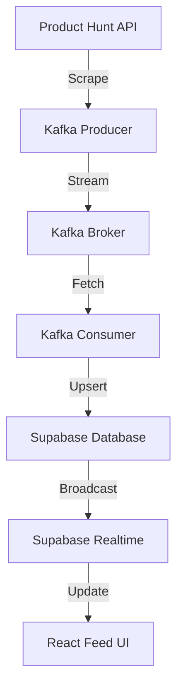

# 🚀 LIVE TECH | Next-Gen AI Discovery Platform

**LIVE TECH** is a futuristic, real-time intelligence dashboard for discovering the latest AI breakthroughs. It features a fully automated discovery engine, a Kafka-powered processing pipeline, and a premium React frontend with instant real-time updates.

---

## ⚡ Key Features

- **Real-time Discovery Feed**: AI tools appear instantly without page refreshes using Supabase Realtime.
- **Infinite Scrolling**: High-performance pagination with skeleton loading and smooth transitions.
- **Discovery Engine**: Python-based scraper that monitors Product Hunt and other sources.
- **Processing Pipeline**: Distributed data flow using Apache Kafka (Producer/Consumer).
- **Premium UI/UX**: Dark-themed cyberpunk aesthetic with Framer Motion animations and glassmorphism.
- **User Intelligence**: Personalized profiles, bookmarking system, and topic filtering.

---

## 🏗️ System Architecture



---

## 🛠️ Technology Stack

- **Frontend**: React (Vite), Tailwind CSS, Framer Motion, Lucide Icons.
- **Backend**: Node.js, Express (API), Python (Scraping & Discovery).
- **Database & Auth**: Supabase (PostgreSQL, Auth, Realtime).
- **Streaming**: Apache Kafka.

---

## 🚀 Getting Started

### 1. Prerequisites
- Node.js (v18+)
- Python (3.9+)
- Apache Kafka (Running locally or on cloud)
- Supabase Account

### 2. Installation

#### Clone the Repository
```bash
git clone https://github.com/Medapatisanjana12/Live-Tech.git
cd Live-Tech
```

#### Frontend Setup
```bash
cd frontend
npm install
cp .env.example .env
# Fill in your Supabase URL and Anon Key
npm run dev
```

#### Backend Setup
```bash
cd ../backend
npm install
node server.js
```

#### Discovery Engine (ai-bulletin) Setup
```bash
cd ../ai-bulletin
pip install -r requirements.txt # Or install: kafka-python, requests, python-dotenv, supabase
# Ensure .env.local contains your SUPABASE_SERVICE_ROLE_KEY and PRODUCTHUNT_TOKEN
python scheduler.py
```

### 🔐 Environment Variables

| Variable | Source | Description |
| :--- | :--- | :--- |
| `VITE_SUPABASE_URL` | Supabase Dashboard | Your project URL |
| `VITE_SUPABASE_ANON_KEY` | Supabase Dashboard | Public Anon Key |
| `SUPABASE_SERVICE_ROLE_KEY` | Supabase Dashboard | Private Service Key (Keep Secret!) |
| `PRODUCTHUNT_TOKEN` | Product Hunt API | Developer API Token |

---

## 🟢 Enabling Real-time
To make the feed update instantly, you **must** enable replication for the `ai_tools` table in your Supabase Dashboard:
`Database -> Replication -> Enable ai_tools`

---

## 📄 License
MIT License - Developed by **Medapatisanjana12**
