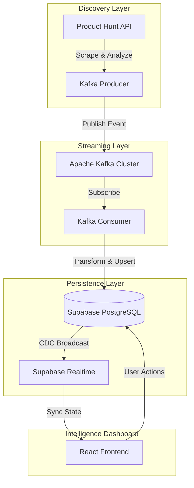

# 🚀 LIVE TECH | Next-Gen AI Intelligence Platform

**LIVE TECH** is a futuristic, real-time intelligence dashboard designed to monitor, analyze, and discover the latest breakthroughs in Artificial Intelligence. By combining automated discovery engines with high-throughput streaming and a premium glassmorphic UI, LIVE TECH provides a window into the rapidly evolving AI ecosystem.

---

## ⚡ Core Intelligence Features

- **Real-time Discovery Engine**: Automated Python agents monitor global AI launchpads (like Product Hunt) and ingest new tools instantly.
- **Dynamic Trending Algorithm**: Tools are analyzed and assigned a "Trending Score" based on community engagement, velocity, and relevance.
- **Kafka-Powered Pipeline**: A robust, distributed data stream ensures that high volumes of AI updates are processed with zero latency.
- **Instant Broadcast**: Built on Supabase Realtime, new intelligence appears in the dashboard without requiring a page refresh.
- **Intelligent Filtering**: Deep categorization allows researchers to filter by specific AI sub-fields (NLP, Computer Vision, Generative AI, etc.).
- **Cyberpunk UI/UX**: A premium dark-mode interface featuring Framer Motion animations, glassmorphism, and responsive layouts.

---

## 🏗️ Intelligence Architecture

The platform follows a distributed microservices pattern to ensure scalability and reliability:



---

## 🛠️ Technology Stack

- **Frontend**: React 19 (Vite), Tailwind CSS 4.0, Framer Motion, Lucide Icons.
- **API Backend**: Node.js, Express, Supabase JS SDK.
- **Discovery Engine**: Python 3.11, `kafka-python`, `requests`, `python-dotenv`.
- **Infrastructure**: Apache Kafka (Streaming), Supabase (PostgreSQL, Auth, Realtime).
- **Deployment**: Render / Railway (Nixpacks & Railpack support included).

---

## 🚀 Deployment Guide (Render)

This repository is optimized for deployment on **Render** or similar platforms.

1.  **Web Service (Backend & Frontend)**:
    *   Build Command: `npm install && npm install --prefix backend && npm install --prefix ai-bulletin`
    *   Start Command: `npm start` (Runs the root script which triggers the backend)
2.  **Environment Variables**:
    *   `SUPABASE_URL`: Your Supabase Project URL.
    *   `SUPABASE_SERVICE_ROLE_KEY`: Your private service role key.
    *   `PRODUCTHUNT_TOKEN`: Your Product Hunt API Developer Token.
    *   `PORT`: The port for the Express server (defaults to 5000).

---

## 🔐 Local Setup

### 1. Prerequisites
- Node.js (v18+)
- Python (3.9+)
- Apache Kafka (Local or Cloud instance)
- Supabase Account

### 2. Installation

#### Clone & Install Root Dependencies
```bash
git clone https://github.com/Medapatisanjana12/Live-Tech.git
cd Live-Tech
npm install
```

#### Frontend Setup
```bash
cd frontend
npm install
cp .env.example .env
# Add your VITE_SUPABASE_URL and VITE_SUPABASE_ANON_KEY
npm run dev
```

#### Backend & Discovery Setup
```bash
cd ../backend
npm install
# Add .env with SUPABASE_URL and SUPABASE_SERVICE_ROLE_KEY
node server.js
```

#### Discovery Engine (ai-bulletin)
```bash
cd ../ai-bulletin
pip install -r requirements.txt
# Ensure .env.local contains your PRODUCTHUNT_TOKEN
python scheduler.py
```

---

## 📄 License
Developed by **Medapatisanjana12** | MIT License
